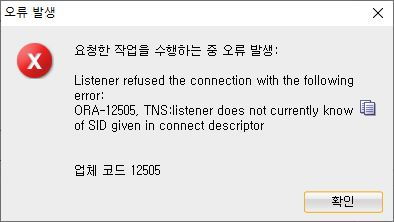

<데이터베이스 프로그래밍 10주차 회고록>
=============================

## 1. 새로 배운 내용
* JDBC
  * JVM과 데이터베이스를 연결시킬 수 있는 API

## 2. 발생한 문제 & 해결 과정
* SQL Developer 접속 오류
  * listener refused connection ora-12505
  
  * SID 확인
    * cmd > ```lsnrctl services```
    * DEDICATED, STATUS는 READY인 SID 사용하면 됨.

## 3. 참고할 만한 내용
* https://blog.naver.com/ingaaa/30035589470
* https://badstorage.tistory.com/2


## 4. 회고
* (+) 오류가 나도 당황하지 않고 그러려니 하며 해결함
* (-) JDBC나 다양한 툴들을 그냥 글로만 읽고 넘어갔는데 조금 더 적극적인 자세로 다뤄봐야겠
* (!) JDBC가 정확히 뭔지 이해함
